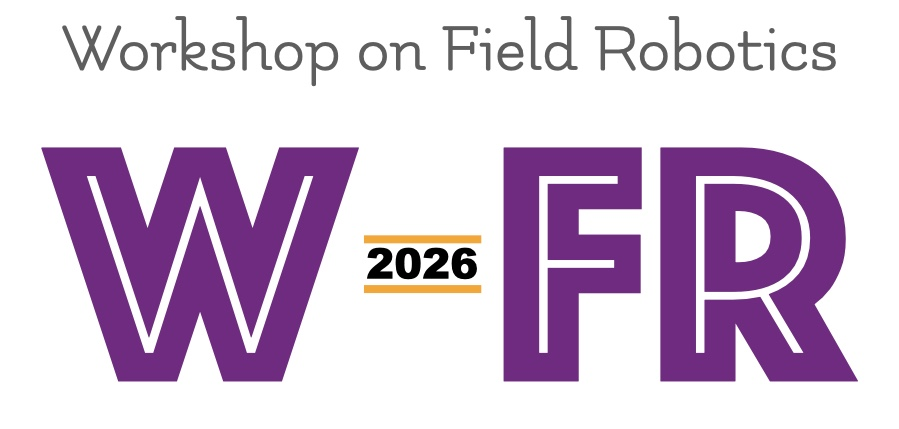
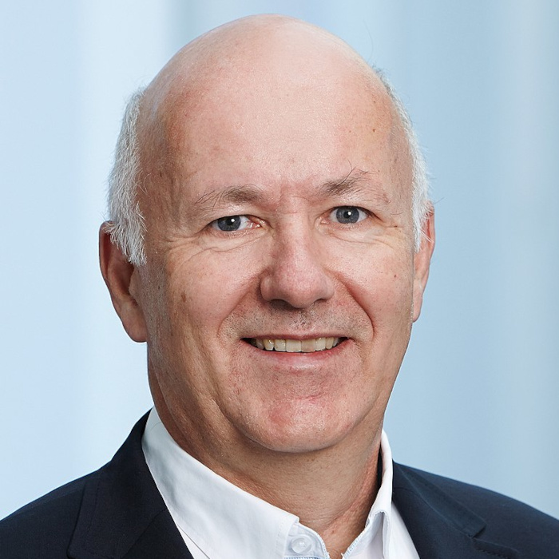
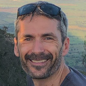
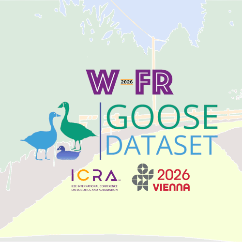
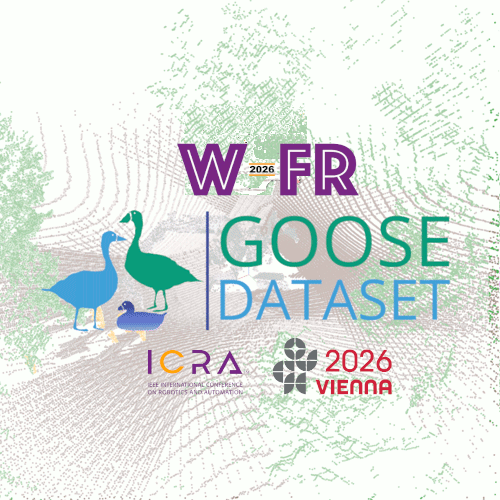
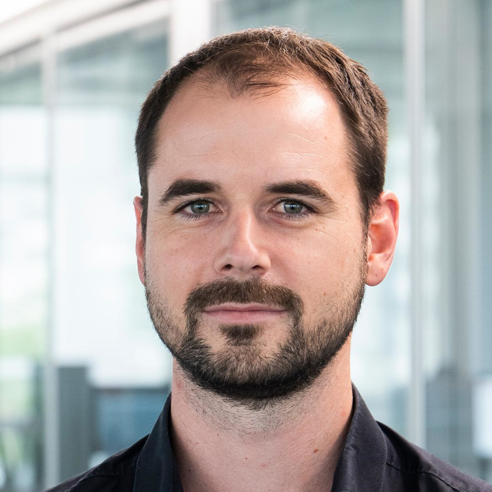

## Important dates

- Submission deadline:  March 15, 2026, 11:59 p.m. (Anywhere on Earth)
- Poster notification of acceptance:  April 1st, 2026
- Spotlight talks notification of acceptance: April 10, 2026
- Camera-ready submission: May 10, 2026, 11:59 p.m. (Anywhere on Earth)
- Workshop date: TBD

The best submissions will be invited to submit a full-length paper in a Special Issue of the [IEEE Transactions on Field Robotics](https://www.ieee-ras.org/publications/t-fr).

- Official Invitations sent: September-October 2026
- Deadline of submission to IEEE T-FR: February 2027

# Context

Field robotics tackles the problem of developing, deploying, and evaluating autonomous mobile systems in unstructured and often dynamic environments. Typical commercial applications are in agriculture, construction, mining, and forestry. The range of physical mediums is also very diversified: in the air, on the ground, underground, on the water, and underwater. These can be located on Earth, or on other celestial bodies (e.g., planets, moons, or asteroids). As such, field robotics works under wildly diverse and radically different assumptions than other areas of robotics, which tend to have well-defined working hypotheses. Therefore, this creates its own set of challenges. This workshop will thus offer the opportunity to present work and discuss how these unique challenges can be solved.

This workshop will bring together experts, researchers, and practitioners to discuss the latest advancements in field robotics. Participants will gain valuable insights into the challenges and opportunities that arise in deploying robots in diverse field scenarios, such as rugged terrains, remote locations, and hazardous environments. Practical case studies and real-world applications will be presented to showcase the successful, and not-so-successful cases of field robotics. The workshop will encourage fruitful dialogues and collaborative discussions, culminating by a panel at the end of the workshop. Attendees will leave with a comprehensive understanding of the state-of-the-art technologies, the main actors, and upcoming challenges. As major outcomes, we aim to consolidate the community around field robotics and prepare an editorial article on the current status of robotics deployed in real environments.

 

# Program
All invited speakers are confirmed.

| **Time**                | **Speaker**                                | **Topic/title**                                                                 |
|---------------------|----------------------------------------|------------------------------------------------------------------------------|
| 8:30- 8:50     | Organizers                      | Welcome and opening remarks |
| 8:50- 9:20     | **Stefan Williams** (University of Sydney) | Tentative title: **The development of highly maneuverable AUV systems for offshore environmental and asset inspection operations** |
| 9:20- 9:40     | Five emerging researchers       | Spotlight talks (3 min/pers) |
| 9:40- 10:40    | Coffee break and poster session                               | - |
| 10:40- 11:10   | **Cédric Pradalier** (Georgia Tech Europe) | Invited talk #2 - Tentative title: **Corrosion Detection on Outer Ship Hulls and Storage Tanks** |
| 11:10- 11:40   | Nina Mahmoudian (Purdue University) | Invited talk #3 - Tentative title: **Adaptive Autonomy for Field Robotics: Enabling Extended Missions in Challenging Environments** |
| 11:40- 13:00   | Lunch                              |  - |
| 13:00- 14:00   | **Roland Siegwart** (ETH Zurich)    | Keynote - Tentative title: **30 years of deployments – From Robot Design to Navigation and Scene Understanding** |
| 14:00- 14:30   | Panel                           | - |
| 14:30- 14:50   | Five emerging researchers       | Spotlight talks (3 min/pers) |
| 14:50- 15:50   | Coffee break and poster session                               | - |
| 15:50- 16:10   | Organizers                      | Result announcement for the dataset competition |
| 16:10- 16:40   | **Fu Zhang** (University of Hong Kong) | Invited talk #4 - Tentative title: **Lidar-centric Navigation for Field Drones** |
| 16:40- 17:10   | **Katie Driggs-Campbell** (University of Illinois Urbana-Champaign) | Invited talk #5 - Tentative title: **Towards Agricultural Robots with Humans in and on the Loop** |
| 17:10- 17:30   | Organizers                      | Conclusion |

***Note**: All times are in the local time zone of ICRA 2026 (Vienna)

# Speakers  
<!-- copy paste this for each speaker

    

    
    

      

        <h3>Title of presentation</h3>
        <strong>Name</strong> 
        <em>Affiliation</em>   
        <a href="">Personal website</a>
      

 
end speaker1-->

 

    

    
    

      

        <h3> From Robot Design to Navigation and Scene Understanding</h3>
        <strong>Roland Siegwart</strong> 
        <em>ETH Zurich</em>   
        <a href="https://mavt.ethz.ch/people/person-detail.siegwart.html">Personal website</a>
      

 

    

    
    

      

        <h3>Low-cost maritime fleet planning and operation</h3>
        <strong>Nina Mahmoudian</strong> 
        <em>Purdue University
</em>   
        <a href="https://engineering.purdue.edu/ME/People/ptProfile?resource_id=211078">Personal website</a>  
      

 

    

    
    

      

        <h3>Corrosion Detection on Outer Ship Hulls and Storage Tanks</h3>
        <strong>Cédric Pradalier</strong> 
        <em>Georgia Tech Europe</em>   
        <a href="https://dream.georgiatech-metz.fr/people/person-detail/cpradalier/">Personal website</a>
      

 

    

    
    

      

        <h3>The development of highly manoeuvrable AUV systems for offshore environmental and asset inspection operations</h3>
        <strong>Stefan Williams</strong> 
        <em>University of Sydney</em>   
        <a href="https://www.sydney.edu.au/engineering/about/our-people/academic-staff/stefan-williams.html">Personal website</a>
      

 

    

    
    

      

        <h3>Towards Agricultural Robots with Humans in and on the Loop</h3>
        <strong>Katie Driggs-Campbell</strong> 
        <em> University of Illinois Urbana-Champaign</em>   
        <a href="https://ece.illinois.edu/about/directory/faculty/krdc">Personal website</a>
      

 

    

    
    

      

        <h3>Lidar-centric navigation for field drones</h3>
        <strong>Fu Zhang</strong> 
        <em>University of Hong Kong</em>   
        <a href="https://mech.hku.hk/academic-staff/zhang-f">Personal website</a>
      

 

# Call for papers

The workshop topics include, but are not limited to:

- Agriculture
- Construction
- Forestry
- Healthcare
- Intelligent Transportation Systems
- Marine Robotics
- Mining
- Search and rescue
- Space exploration

## Submission guidelines

The selection of the participants for the poster sessions will be based on submitted posters, following these criteria:

The selection of the participants for the poster sessions will be based on submitted posters, following these criteria:
- Relevance of the contribution with respect to field robotics (e.g., unacceptable would be only simulation, weak would be on a campus, strong would include challenging outdoor and remote locations;
- Evidence of the proposed results based on field experiments (e.g., weak would be a single experiment, strong would be multiple visits to a site or multiple sites);
Quality of the analysis (e.g., unacceptable would be anecdotal results, weak would be qualitative results or time series, strong would be quantitative results with statistical evidence).

- The posters should be submitted on [Microsoft CMT](https://cmt3.research.microsoft.com/FRICRA2025).

In addition to a poster presentation, a subselection of the submitted posters will be made for rapid-fire talks to provide added exposure to emerging researchers (e.g., PhD students, early career professors). This selection will be made based on:
The potential for visually interesting results;
Meaningfulness of the lessons learned through field experiments and expert interviews.

# Competition

This year, the field robotics workshop features multiple competition tracks designed to address key challenges in field robot deployment.
The competition focuses on SLAM and vision-based tasks of 2D and 3D Semantic Segmentation in challenging environments like dense vegetation. 
Participants have access to extensive datasets, including recordings from wheeled, tracked, and multi-legged robots navigating challenging off-road terrains from the [GOOSE](https://goose-dataset.de/) and [GOOSE-Ex](https://arxiv.org/pdf/2409.18788) dataset. 
The SLAM dataset features radar-based perception data for off-road environments and multispectral data for scenarios where passive sensors are crucial. 

The top-performing teams are invited to present their results during the workshop poster sessions and receive prizes.
The competitions are open to all field robotics researchers and practitioners.

Please visit the competition websites for more details:

    

    
    

      

        <strong style="padding-left: 30px">GOOSE 2D Semantic Segmentation Challenge</strong> 
        <em style="padding-left: 30px">1000€ gift voucher for the 1st place team</em> 
        <a style="padding-left: 30px" href="https://tinyurl.com/goose-2d-challenge">Codabench website</a>
      

 

    

    
    

      

        <strong style="padding-left: 30px">GOOSE 3D Semantic Segmentation Challenge</strong> 
        <em style="padding-left: 30px">500€ gift voucher for the 1st place team</em> 
        <a style="padding-left: 30px" href="https://tinyurl.com/goose-3d-challenge">Codabench website</a>
      

 

Any questions about the competition can be directed at [field-robotics-competition-icra-25@googlegroups.com](mailto:field-robotics-competition-icra-25@googlegroups.com?subject=Question%20regarding%20the%20Field%20Robotics%20Dataset%20Competitions).

# Organizers

    

    
    

      

        <strong>François Pomerleau</strong> 
        <em>Université Laval</em> 
        <a href="https://norlab.ulaval.ca/people/f_pomerleau/">Personal website</a>
      

 

    

    
    

      

        <strong>Johann Laconte</strong> 
        <em>French National Research Institute for Agriculture, Food and Environment (INRAE)</em>  
        <a href="http://rleaf.mathnum.inrae.fr/people/jlaconte/">Personal website</a>
      

 

    

    
    

      

        <strong>Joshua Mangelson </strong> 
        <em>Brigham Young University</em>  
        <a href="https://ece.byu.edu/directory/josh-mangelson">Personal website</a>
      

 

    

    
    

      

        <strong>Marco Hutter</strong> 
        <em>ETH Zurich</em>  
        <a href="https://rsl.ethz.ch/the-lab/people/person-detail.MTIxOTEx.TGlzdC8yNDQxLC0xNDI1MTk1NzM1.html">Personal website</a>
      

 

 

    

    
    

      

        <strong>Stéphanie Aravecchia</strong> 
        <em> Georgia Tech Europe</em>  
        <a href="https://dream.georgiatech-metz.fr/people/person-detail/saravecchia/">Personal website</a>
      

 

 

    

    
    

      

        <strong>Edith Brotherton</strong> 
        <em>Université Laval</em>  
        <a href="https://norlab.ulaval.ca/people/e_brotherton_fr/">Personal website</a>
      

 

## Competition Organizers

  <table style="margin: 0 auto; border-collapse: collapse; border: none; cellpadding: 0; cellspacing: 0;">
    <tr>
      <td style="width: 80px; vertical-align: top; height: 120px; border: none;">
         <strong>Jan Faigl</strong>
      </td>
      <td style="width: 80px; vertical-align: top; height: 120px; border: none;">
         <strong>Gerald Steinbauer-Wagner</strong>
      </td>
      <td style="width: 80px; vertical-align: top; height: 120px; border: none;">
         <strong>Miloš Prágr</strong>
      </td>
      <td style="width: 80px; vertical-align: top; height: 120px; border: none;">
         <strong>Raphael Hagmanns</strong>
      </td>
    </tr>
    <tr>
      <td style="width: 80px; vertical-align: top; height: 120px; border: none;">
         <strong>Miguel Granero</strong>
      </td>
      <td style="width: 80px; vertical-align: top; height: 120px; border: none;">
         <strong>Vladimír Kubelka</strong>
      </td>
      <td style="width: 80px; vertical-align: top; height: 120px; border: none;">
         <strong>Peter Mortimer</strong>
      </td>
    </tr>
  </table>

## Previous Editions

- [2025 Workshop on Field Robotics](https://norlab-ulaval.github.io/workshop_field_robotics_icra2025/)
- [2024 Workshop on Field Robotics](https://norlab-ulaval.github.io/workshop_field_robotics_icra2024/)
